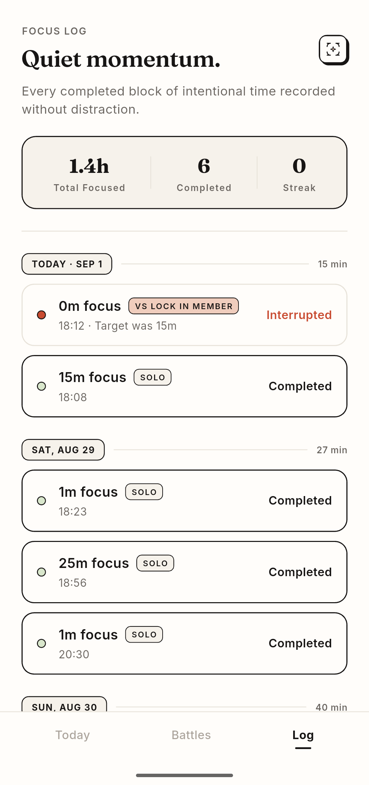
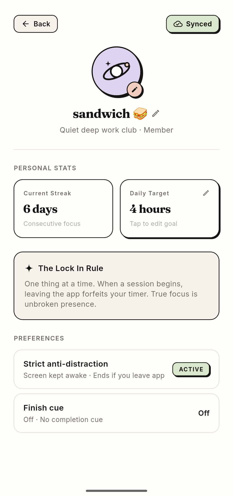

<p align="center">
  
</p>

<h1 align="center">LockIn</h1>

<p align="center">
  <strong>The competitive, anti-distraction focus timer designed to cultivate unbreakable deep work.</strong>
</p>

<p align="center">
  <a href="https://github.com/Abhaynegi1/Lock-In/releases/latest/download/LockIn-Android.apk"></a>
  <a href="https://github.com/Abhaynegi1/Lock-In/releases/latest"></a>
</p>

---

## 📲 Direct Android Download

Get the app directly on your Android phone without visiting app stores:

| 1-Click Direct Download | Scan with Phone Camera |
| :---: | :---: |
| [](https://github.com/Abhaynegi1/Lock-In/releases/latest/download/LockIn-Android.apk)<br><br>👉 **[Direct Link to Latest APK](https://github.com/Abhaynegi1/Lock-In/releases/latest/download/LockIn-Android.apk)** 👈 |  |

> **How to install on Android:**
> 1. Tap the download link or scan the QR code with your phone.
> 2. Open the downloaded `LockIn-Android.apk` file.
> 3. If prompted with *"Install unknown apps"*, tap **Settings** and enable **"Allow from this source"**.
> 4. Tap **Install** and enjoy!

---

## 📸 App Preview

| Solo Focus | Active Session | Session Complete & Extend |
| :---: | :---: | :---: |
|  |  |  |

| 1v1 Battle Lobby | Battle Results | Focus Logs & Streaks | Profile & Settings |
| :---: | :---: | :---: | :---: |
|  |  |  |  |

---

## 🎯 Why We Built LockIn

Most productivity and Pomodoro timers fail for two fundamental reasons:

1. **They have no teeth**: When a timer has zero consequences, it’s effortless to swipe away to social media, answer non-urgent notifications, and pretend you're working.
2. **They feel lonely and clinical**: Deep work can feel isolating, and most timer apps look like sterile medical dashboards or neon-soaked arcade games.

**LockIn was built to change how you relate to your focus hours:**
- **High-Stakes Accountability**: If you leave the app while locked in, you forfeit. No excuses.
- **Social Accountability (Focus Battles)**: Turn solitary grind sessions into thrilling 1-on-1 focus duels against friends, study buddies, and colleagues.
- **Tactile Editorial Aesthetic**: Designed like a physical artisanal desk journal—warm paper tones, ink-black typography, and hand-drawn doodles that create a calm, grounded headspace for real work.

---

## ✨ Key Features

### ⏱️ 1. Solo Deep Work & Custom Sessions
- Choose from standard focus intervals (**15m sprint**, **25m classic Pomodoro**, **45m deep focus**, **60m endurance**) or configure custom durations (1 - 180 min).
- **Session Overtime & Extensions**: When a session completes and you're in the zone, extend your session (+5m, +10m, +15m, +25m, or fine-tuned stepper) without breaking flow.
- Clean circular progress visualization with real-time countdown.
- Full support for **Portrait** and **Landscape / Desk Stand** modes for zero-distraction desk setups.

### 🛡️ 2. Strict Anti-Distraction Protection (*Lock-In Mode*)
- When enabled, leaving the app, switching apps, or returning to the home screen immediately triggers a forfeit countdown.
- **Display Keep-Awake**: While actively focusing in strict mode, the screen is safely kept awake to prevent mobile inactivity sleep timeouts from prematurely forfeiting your session.
- Fosters true presence and unbroken flow state by making distraction costly.
- Win/loss outcomes are logged in your permanent session record.

### ⚔️ 3. Live 1-on-1 Focus Battles
- Challenge friends and accountability partners to head-to-head focus duels.
- **Custom Battle Durations**: Host rooms with preset intervals or any custom duration from 1 to 180 minutes.
- **Battle Overtime**: When a duel finishes, the host can extend the session in real-time, automatically syncing both players back into active focus.
- Real-time score comparison (`Your Minutes` vs. `Opponent's Minutes`).
- Live countdown timers showing remaining battle time and dynamic status indicators showing who is currently leading.
- **Dedicated Real-Time WebSocket Infrastructure**: Low-latency multiplayer room matching powered by a dedicated Node.js WebSocket engine with 100% guest support and zero login required.

### 📊 4. Daily Goals, Streaks & Session History
- **Configurable Daily Target**: Set daily focus goals (e.g., 2h, 4h, 6h) with live progress percentage and visual gauges.
- **Streak Protection**: Track consecutive days of completed deep work to build lasting habits.
- **Detailed History Log**: Review every session with duration timestamps, win/forfeit badges, and opponent matchup details.

### 🎨 5. Tactile Editorial & Journal Design
- Built around a bespoke color palette featuring warm sand/parchment surfaces (`#FBF9F4`), rich ink (`#1A1A1A`), and subtle terracotta accents (`#D95D39`).
- Elegant typography pairings with hand-drawn doodle badges, stamps, and underlines.
- Tactile interactions with micro-animations that feel organic and deliberate.

### ☁️ 6. Local-First Cloud Backup & Cross-Device Sync
- **100% Offline-Capable**: The app is completely functional with zero accounts required.
- **Optional Google Sign-In via Supabase**: Seamless OAuth 2.0 PKCE authentication with deep linking (`io.supabase.lockin://login-callback`).
- **Silent Background Auto-Sync**: Automatically synchronizes focus blocks, streaks, daily goals, and preferences across devices upon session completion, app launch, or settings update without manual effort.
- **Row Level Security (RLS)**: User data is cryptographically protected and private to each authenticated user in Supabase Postgres.

### 🔔 7. Finish Cues & Library Mode
- **Acknowledgment, Not an Alarm**: Never acts like an alarm clock. Gentle, harmonic tones (Soft Bell, Warm Tone, Gentle Chime) with soft attack ramps and natural decay.
- **Off by Default**: Clean, distraction-free default state.
- **Library Mode (Vibration Only)**: Completely silent, subtle double-pulse haptic (`• •`) for quiet study spaces, coffee shops, and libraries.
- **Live Previews**: Sample each tone directly from the profile settings sheet before selecting.

### ⚡ 8. Flow-State Session Extension
- **Keep the Momentum Going**: When a session finishes and you're in deep flow, extend without leaving the zone.
- **Customizable Extension**: Choose from a default +5m extension with tactile `[-]`/`[+]` steppers or quick preset chips (`+5m`, `+10m`, `+15m`, `+25m`).
- **Seamless Database Upsert**: Upon finishing the extension, your session updates in place in local storage and cloud database (e.g. 25m base + 5m extension = 30m unbroken focus).
- **Bulletproof Streak Protection**: If interrupted or ended early during the extension, your completed 25m session is 100% safeguarded in storage and your streak is never penalized.

---

> 📖 **Architecture Documentation**: For deep architectural design, offline sync details, and technical roadmaps, refer to the [Architecture Guide](docs/ARCHITECTURE.md).

---

## 🚀 Getting Started

### 🐳 Instant Docker Quickstart (Recommended)

Run the entire system (Flutter Web frontend + WebSocket Battle Server) in one command without installing Flutter, Dart, or Java:

```bash
docker compose up --build
```

- **Web App**: [http://localhost:3000](http://localhost:3000)
- **Battle Server WebSocket**: `ws://localhost:8080`
- **Battle Server Health**: [http://localhost:8080/health](http://localhost:8080/health)

> 📖 **Full Docker Guide**: For instructions on testing, DevContainers, and cloud deployment, see [DOCKER.md](DOCKER.md).

---

### 💻 Local Machine Setup (Optional)

#### Prerequisites
- [Flutter SDK](https://flutter.dev/docs/get-started/install) `^3.10.8` or higher
- [Dart SDK](https://dart.dev/get-dart) `^3.0.0`
- [Android Studio](https://developer.android.com/studio) / [Xcode](https://developer.apple.com/xcode/) with configured emulators
- Java JDK 17 (required for Android Gradle builds)

### Installation

1. **Clone the repository**:
   ```bash
   git clone https://github.com/Abhaynegi1/Lock-In.git
   cd Lock-In
   ```

2. **Install Flutter dependencies**:
   ```bash
   flutter pub get
   ```

3. **Run the application**:
   - On an Android Emulator / Device:
     ```bash
     flutter run -d android
     ```
   - On iOS Simulator / Device:
     ```bash
     flutter run -d ios
     ```
   - On Chrome (Web):
     ```bash
     flutter run -d chrome
     ```

---

## 🧪 Testing & Continuous Integration

LockIn incorporates a strict Continuous Integration (CI) pipeline running on GitHub Actions (`.github/workflows/ci.yml`) that validates every commit and pull request.

### Quality Verification Commands

Before pushing code or creating a PR, run the local verification suite:

1. **Static Analysis & Linting**:
   ```bash
   flutter analyze --fatal-infos --fatal-warnings
   ```

2. **Automated Unit & Widget Tests**:
   ```bash
   flutter test --coverage
   ```

3. **Android Build Verification**:
   ```bash
   flutter build apk --debug
   ```

4. **Web Build Verification**:
   ```bash
   flutter build web --release
   ```

---

## 📄 License

This project is licensed under the MIT License - see the [LICENSE](LICENSE) file for details.
